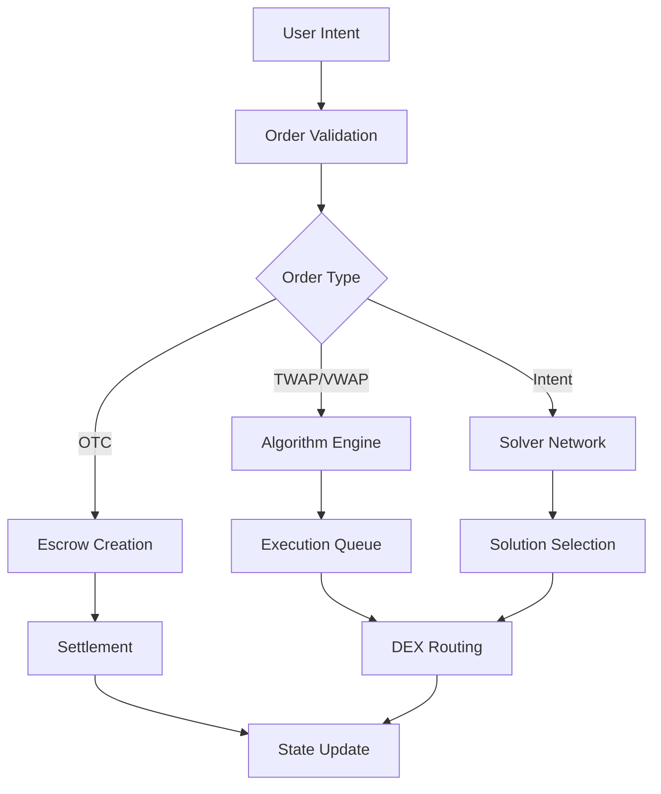
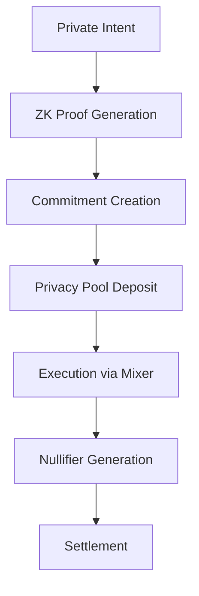

# Technical Architecture

> **Implementation blueprint for whale trading infrastructure on Solana**

## Core Architecture Principles

### Performance First
- **Target Latency**: <400ms from intent to execution confirmation
- **Throughput**: 1,000+ orders/second sustained
- **Availability**: 99.9% uptime with graceful degradation
- **Scalability**: Handle $1B+ daily volume from day one

### Security by Design
- **Multi-signature governance**: 5-of-9 for critical operations
- **Formal verification**: All critical paths mathematically proven
- **Zero-trust architecture**: Every component independently verified
- **Emergency controls**: Circuit breakers at every layer

### Privacy Native
- **ZK-first design**: Privacy built into core protocols, not added on
- **Mixing by default**: All transactions use privacy pools when possible
- **Selective disclosure**: Compliance without sacrificing privacy
- **Anonymity preservation**: Maintain whale trading patterns private

## System Architecture Overview

```
┌─────────────────────────────────────────────────────────────┐
│                    Client Interface Layer                    │
│  ┌─────────────┐ ┌──────────────┐ ┌─────────────────────┐  │
│  │Professional │ │ Mobile Apps  │ │   API Gateway       │  │
│  │   Trading   │ │              │ │                     │  │
│  │  Interface  │ │              │ │  - Rate limiting    │  │
│  └─────────────┘ └──────────────┘ │  - Authentication   │  │
│                                   │  - Request routing  │  │
│                                   └─────────────────────┘  │
├─────────────────────────────────────────────────────────────┤
│                     Service Layer                           │
│  ┌─────────────┐ ┌──────────────┐ ┌─────────────────────┐  │
│  │   Order     │ │   Intent     │ │     Privacy         │  │
│  │ Management  │ │  Processing  │ │    Services         │  │
│  │             │ │              │ │                     │  │
│  │ - Validation│ │ - Strategy   │ │ - ZK Proof Gen      │  │
│  │ - Routing   │ │ - Matching   │ │ - Mixing Pools      │  │
│  │ - Tracking  │ │ - Execution  │ │ - Stealth Routing   │  │
│  └─────────────┘ └──────────────┘ └─────────────────────┘  │
├─────────────────────────────────────────────────────────────┤
│                  Execution Engine Layer                     │
│  ┌─────────────┐ ┌──────────────┐ ┌─────────────────────┐  │
│  │    TWAP     │ │     VWAP     │ │   Smart Routing     │  │
│  │  Executor   │ │   Executor   │ │     Engine          │  │
│  │             │ │              │ │                     │  │
│  │ - Time      │ │ - Volume     │ │ - Liquidity Agg     │  │
│  │   Splitting │ │   Analysis   │ │ - Venue Selection   │  │
│  │ - Random    │ │ - Market     │ │ - Route Optimization│  │
│  │   Timing    │ │   Adaptation │ │ - Execution Quality │  │
│  └─────────────┘ └──────────────┘ └─────────────────────┘  │
├─────────────────────────────────────────────────────────────┤
│                   Blockchain Layer (Solana)                 │
│  ┌─────────────┐ ┌──────────────┐ ┌─────────────────────┐  │
│  │ OTC Trading │ │  Algorithm   │ │   Privacy Pool      │  │
│  │  Program    │ │  Execution   │ │    Program          │  │
│  │             │ │   Program    │ │                     │  │
│  │ - Escrows   │ │ - TWAP/VWAP  │ │ - ZK Verification   │  │
│  │ - RFQ       │ │ - Intent     │ │ - Nullifier Mgmt    │  │
│  │ - Dark Pool │ │   Solving    │ │ - Commitment Trees  │  │
│  │ - Settlement│ │ - MEV Shield │ │ - Mixing Logic      │  │
│  └─────────────┘ └──────────────┘ └─────────────────────┘  │
├─────────────────────────────────────────────────────────────┤
│                 Infrastructure Layer                        │
│  ┌─────────────┐ ┌──────────────┐ ┌─────────────────────┐  │
│  │   Oracle    │ │  Cross-Chain │ │   Data & Storage    │  │
│  │ Aggregator  │ │   Bridges    │ │     Services        │  │
│  │             │ │              │ │                     │  │
│  │ - Pyth      │ │ - Wormhole   │ │ - Arweave (history) │  │
│  │ - Switchbd  │ │ - LayerZero  │ │ - IPFS (metadata)   │  │
│  │ - Chainlink │ │ - Hyperlane  │ │ - Redis (cache)     │  │
│  │ - Custom    │ │ - Axelar     │ │ - Postgres (state)  │  │
│  └─────────────┘ └──────────────┘ └─────────────────────┘  │
└─────────────────────────────────────────────────────────────┘
```

## Solana Program Architecture

### Program Dependencies and Communication

```
┌─ Main Controller Program (moby-controller) ────────────────┐
│                                                            │
│  Controls and coordinates all operations                   │
│  ├─ Program upgrades and governance                       │
│  ├─ Emergency pause mechanisms                            │
│  ├─ Cross-program invocation routing                      │
│  └─ Global state management                               │
│                                                            │
├─ CPI Calls ───────────────────────────────────────────────┤
│                                                            │
│ ┌─ OTC Trading Program ──┐ ┌─ Algorithm Execution ──────┐ │
│ │ (moby-otc)             │ │ (moby-executor)            │ │
│ │                        │ │                            │ │
│ │ • Fixed price orders   │ │ • TWAP implementation      │ │
│ │ • RFQ system           │ │ • VWAP implementation      │ │
│ │ • Dark pools           │ │ • Intent processing        │ │
│ │ • Escrow management    │ │ • Solver competition       │ │
│ │ • Settlement logic     │ │ • MEV protection           │ │
│ └────────────────────────┘ └────────────────────────────┘ │
│                                                            │
│ ┌─ Privacy Program ───────┐ ┌─ Oracle Aggregator ────────┐ │
│ │ (moby-privacy)          │ │ (moby-oracle)              │ │
│ │                         │ │                            │ │
│ │ • ZK proof verification │ │ • Multi-oracle aggregation │ │
│ │ • Commitment trees      │ │ • Price feed validation    │ │
│ │ • Nullifier management  │ │ • Staleness checking       │ │
│ │ • Privacy pools         │ │ • Manipulation detection   │ │
│ │ • Mixing protocols      │ │ • Emergency price feeds    │ │
│ └─────────────────────────┘ └────────────────────────────┘ │
└────────────────────────────────────────────────────────────┘

External Program Integration:
├─ DEX Programs: Raydium, Orca, Phoenix, Serum
├─ Bridge Programs: Wormhole, Allbridge, Portal
├─ Oracle Programs: Pyth, Switchboard, Chainlink
└─ Lending Programs: Solend, Mango, Marginfi
```

### Critical Account Structures

#### Global State Accounts
```rust
// Main system state
#[account]
#[derive(InitSpace)]
pub struct GlobalState {
    pub authority: Pubkey,              // 32 bytes
    pub paused: bool,                   // 1 byte
    pub emergency_mode: bool,           // 1 byte
    pub total_volume_traded: u64,       // 8 bytes
    pub total_fees_collected: u64,      // 8 bytes
    pub supported_tokens: Vec<Pubkey>,  // 4 + 32*n bytes
    pub fee_collector: Pubkey,          // 32 bytes
    pub upgrade_authority: Pubkey,      // 32 bytes
    pub created_at: i64,                // 8 bytes
    pub last_updated: i64,              // 8 bytes
}

// Program configuration
#[account]
#[derive(InitSpace)]
pub struct ProgramConfig {
    pub max_compute_units: u32,         // 4 bytes
    pub priority_fee_multiplier: u16,   // 2 bytes
    pub slippage_tolerance_bps: u16,    // 2 bytes
    pub max_accounts_per_tx: u8,        // 1 byte
    pub risk_parameters: RiskParams,    // Variable size
    pub fee_structure: FeeStructure,    // Variable size
}
```

#### OTC Trading Accounts
```rust
#[account]
#[derive(InitSpace)]
pub struct OTCOrder {
    pub order_id: [u8; 32],             // Unique order identifier
    pub maker: Pubkey,                  // Order creator
    pub taker: Option<Pubkey>,          // Order acceptor (if filled)
    pub token_mint_a: Pubkey,           // Sell token
    pub token_mint_b: Pubkey,           // Buy token
    pub amount_a: u64,                  // Sell amount
    pub amount_b: u64,                  // Buy amount
    pub filled_amount_a: u64,           // Amount filled (sell side)
    pub filled_amount_b: u64,           // Amount filled (buy side)
    pub min_fill_amount: u64,           // Minimum partial fill
    pub expiry: i64,                    // Expiration timestamp
    pub order_type: OTCOrderType,       // Fixed, RFQ, Dark
    pub privacy_level: PrivacyLevel,    // Public, Stealth, Anonymous
    pub status: OrderStatus,            // Created, Partial, Filled, Cancelled
    pub created_at: i64,
    pub updated_at: i64,
    pub fees_paid: u64,
    pub slippage_tolerance: u16,        // Basis points
    pub maker_fee_bps: u16,
    pub taker_fee_bps: u16,
}

#[account]
#[derive(InitSpace)]
pub struct OTCEscrow {
    pub order_id: [u8; 32],
    pub escrow_authority: Pubkey,
    pub token_account_a: Pubkey,        // Escrow token account A
    pub token_account_b: Pubkey,        // Escrow token account B
    pub deposited_amount_a: u64,
    pub deposited_amount_b: u64,
    pub release_conditions: Vec<ReleaseCondition>,
    pub settlement_instructions: Vec<SettlementInstruction>,
}
```

#### Algorithm Execution Accounts
```rust
#[account]
#[derive(InitSpace)]
pub struct TWAPOrder {
    pub order_id: [u8; 32],
    pub trader: Pubkey,
    pub token_in: Pubkey,
    pub token_out: Pubkey,
    pub total_amount_in: u64,
    pub executed_amount_in: u64,
    pub min_amount_out: u64,
    pub received_amount_out: u64,
    pub time_window_seconds: i64,
    pub num_intervals: u32,
    pub current_interval: u32,
    pub randomness_factor: u8,          // 0-100, timing randomization
    pub max_slippage_bps: u16,
    pub next_execution_time: i64,
    pub interval_amounts: Vec<u64>,     // Pre-calculated execution amounts
    pub venue_preferences: Vec<VenueWeight>,
    pub execution_history: Vec<ExecutionRecord>,
    pub status: AlgorithmStatus,        // Active, Paused, Completed, Cancelled
    pub privacy_enabled: bool,
    pub created_at: i64,
    pub updated_at: i64,
}

#[account]
#[derive(InitSpace)]
pub struct VWAPOrder {
    pub order_id: [u8; 32],
    pub trader: Pubkey,
    pub token_pair: TokenPair,
    pub total_amount: u64,
    pub executed_amount: u64,
    pub target_participation_bps: u16,  // Basis points of market volume
    pub volume_curve_type: VolumeCurveType,
    pub time_horizon_hours: u8,
    pub rebalance_frequency_minutes: u16,
    pub market_conditions: MarketConditions,
    pub volume_forecast: Vec<VolumeDataPoint>,
    pub execution_schedule: Vec<VWAPInterval>,
    pub adaptive_parameters: AdaptiveParams,
}
```

#### Privacy System Accounts
```rust
#[account]
#[derive(InitSpace)]
pub struct PrivacyPool {
    pub pool_id: [u8; 32],
    pub merkle_tree_root: [u8; 32],
    pub merkle_tree_height: u8,         // Usually 20 for ~1M deposits
    pub next_leaf_index: u32,
    pub commitment_scheme: CommitmentScheme,
    pub zk_circuit_id: [u8; 32],
    pub verification_key_hash: [u8; 32],
    pub nullifier_hashes: Vec<[u8; 32]>, // Spent nullifiers
    pub min_deposit_amount: u64,
    pub deposit_fee_bps: u16,
    pub withdrawal_delay_seconds: i64,
    pub anonymity_set_size: u32,        // Current participants
    pub total_deposited: u64,
    pub total_withdrawn: u64,
    pub pool_statistics: PoolStatistics,
    pub compliance_module: Option<ComplianceModule>,
}

#[account(zero_copy)] // Large account, use zero-copy
pub struct CommitmentTree {
    pub tree_height: u8,
    pub filled_subtrees: [u8; 32; 20], // Merkle tree subtree hashes
    pub zeros: [u8; 32; 20],          // Zero hashes at each level
    pub current_root_index: u8,
    pub next_index: u32,
    pub roots: [[u8; 32]; 100],       // Ring buffer of recent roots
}

#[account]
#[derive(InitSpace)]
pub struct PrivateTransaction {
    pub tx_id: [u8; 32],
    pub nullifier_hash: [u8; 32],
    pub commitment: [u8; 32],
    pub encrypted_amount: Vec<u8>,       // ElGamal encrypted amount
    pub encrypted_memo: Vec<u8>,         // Optional encrypted memo
    pub zk_proof: Vec<u8>,              // Serialized proof
    pub public_amount: i64,              // Positive for deposits, negative for withdrawals
    pub fee: u64,
    pub created_at: i64,
}
```

## Data Flow Architecture

### Order Processing Flow



### Privacy Flow



## Account Structure

### Core Account Types

```rust
// Main Controller State
pub struct ControllerState {
    pub authority: Pubkey,
    pub paused: bool,
    pub fee_collector: Pubkey,
    pub supported_programs: Vec<Pubkey>,
    pub emergency_contacts: Vec<Pubkey>,
}

// OTC Escrow Account
pub struct OTCEscrow {
    pub seller: Pubkey,
    pub buyer: Pubkey,
    pub token_mint_a: Pubkey,
    pub token_mint_b: Pubkey,
    pub amount_a: u64,
    pub amount_b: u64,
    pub expiry: i64,
    pub partial_fill_allowed: bool,
    pub min_fill_size: u64,
    pub escrow_state: EscrowState,
    pub privacy_mode: PrivacyLevel,
}

// TWAP Order State
pub struct TWAPOrder {
    pub trader: Pubkey,
    pub token_in: Pubkey,
    pub token_out: Pubkey,
    pub total_amount: u64,
    pub executed_amount: u64,
    pub time_window: i64,
    pub num_splits: u32,
    pub current_split: u32,
    pub randomness_factor: u8,
    pub price_deviation_limit: u16,
    pub min_output_per_interval: u64,
}

// Privacy Pool Account
pub struct PrivacyPool {
    pub pool_id: Pubkey,
    pub anonymity_set_size: u32,
    pub min_deposit: u64,
    pub withdrawal_delay: i64,
    pub merkle_tree_root: [u8; 32],
    pub compliance_module: Option<ComplianceHook>,
}
```

## Cross-Program Integration

### Supported DEX Protocols

1. **Serum**: Central limit order book
2. **Raydium**: Automated market maker
3. **Orca**: Concentrated liquidity
4. **Phoenix**: Next-gen order book
5. **Lifinity**: Proactive market maker

### Integration Pattern

```rust
pub enum DexIntegration {
    DirectCPI {
        program_id: Pubkey,
        instruction_data: Vec<u8>,
    },
    AggregatorRoute {
        jupiter_program: Pubkey,
        route_data: Vec<u8>,
    },
    CustomAdapter {
        adapter_program: Pubkey,
        execution_params: Vec<u8>,
    },
}
```

## Compute & Storage Optimization

### Compute Budget Management
- **Max Compute Units**: 1,400,000 per transaction
- **Priority Fee**: Dynamic based on network congestion
- **Account Pre-allocation**: Reduces runtime compute costs

### Storage Strategy
- **On-chain**: Critical state, active orders, proofs
- **Arweave**: Historical data, analytics
- **IPFS**: Metadata, documentation
- **Shadow Drive**: High-frequency cache

## Scalability Considerations

### Horizontal Scaling
- Multiple program deployments for load distribution
- Account sharding for parallel processing
- Regional node optimization

### Vertical Optimization
- Instruction packing
- Account compression
- State rent optimization
- Compute unit efficiency

## Security Architecture

### Multi-layer Security

1. **Program Level**: Input validation, access controls
2. **Account Level**: Owner verification, state consistency
3. **Network Level**: Oracle validation, MEV protection
4. **Economic Level**: Stake requirements, slashing conditions

### Emergency Procedures

- **Circuit Breaker**: Immediate pause capability
- **Upgrade Path**: Controlled migration procedures
- **Recovery Mode**: State reconstruction capabilities
- **Governance Override**: Multi-sig emergency controls

## Cross-Chain Architecture

### Bridge Integration

```rust
pub struct CrossChainOrder {
    pub source_chain: ChainId,
    pub destination_chain: ChainId,
    pub wormhole_message_hash: [u8; 32],
    pub layerzero_packet_id: Option<u64>,
    pub bridge_provider: BridgeProvider,
    pub timeout: i64,
    pub retry_params: RetryConfig,
}
```

### Supported Bridges
- **Wormhole**: Primary cross-chain messaging
- **LayerZero**: Alternative messaging protocol
- **Custom Bridges**: Protocol-specific implementations

## Monitoring & Observability

### Metrics Collection
- Transaction success rates
- Execution latency percentiles
- Slippage measurements
- Privacy pool entropy
- Cross-chain settlement times

### Alerting System
- Performance degradation alerts
- Security incident notifications
- Liquidity shortage warnings
- Oracle deviation alerts

## Future Architecture Evolution

### Planned Enhancements
- **Parallel Execution**: Transaction parallelization
- **State Compression**: Merkle tree state management
- **Advanced Oracles**: Custom oracle networks
- **AI Integration**: Machine learning for execution optimization