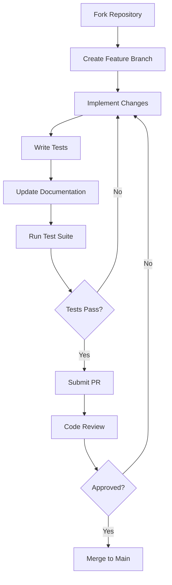

# Developer Guide

## Overview

This guide provides comprehensive instructions for developers who want to build, deploy, integrate with, or contribute to the Moby Market whale trading infrastructure.

## Development Environment Setup

### Prerequisites

```bash
# Required tools
node >= 18.0.0
npm >= 8.0.0
rustc >= 1.70.0
solana-cli >= 1.16.0
anchor-cli >= 0.28.0

# Optional but recommended
docker >= 20.10.0
git >= 2.30.0
```

### Installation

#### 1. Clone the Repository
```bash
git clone https://github.com/moby-market/moby-market.git
cd moby-market
```

#### 2. Install Dependencies
```bash
# Install Node.js dependencies
npm install

# Install Rust dependencies
cd programs && cargo build
cd ..

# Install Anchor dependencies
anchor build
```

#### 3. Environment Configuration
```bash
# Copy environment template
cp .env.example .env

# Configure your environment variables
SOLANA_NETWORK=devnet
ANCHOR_PROVIDER_URL=https://api.devnet.solana.com
ANCHOR_WALLET=~/.config/solana/id.json
PYTHNET_RPC=https://pythnet.rpc.pythnet.pyth.network
```

## Project Structure

```
moby-market/
├── programs/                   # Solana programs (smart contracts)
│   ├── otc-settlement/        # OTC trading program
│   ├── execution-engine/      # TWAP/VWAP algorithms
│   ├── privacy-layer/         # ZK proof system
│   └── oracle-aggregator/     # Price feed aggregation
├── app/                       # Frontend application
│   ├── components/            # React components
│   ├── hooks/                 # Custom React hooks
│   ├── utils/                 # Utility functions
│   └── types/                 # TypeScript definitions
├── sdk/                       # Client SDK
│   ├── typescript/            # TypeScript SDK
│   ├── python/                # Python SDK
│   └── rust/                  # Rust SDK
├── tests/                     # Test suites
│   ├── integration/           # Integration tests
│   ├── unit/                  # Unit tests
│   └── e2e/                   # End-to-end tests
├── docs/                      # Documentation
├── scripts/                   # Deployment and utility scripts
└── circuits/                  # ZK circuits
    ├── transaction/           # Transaction privacy circuits
    ├── range-proof/           # Range proof circuits
    └── compliance/            # Compliance circuits
```

## Building from Source

### Smart Contracts

```bash
# Build all programs
anchor build

# Build specific program
cd programs/otc-settlement
cargo build-bpf

# Run program tests
anchor test
```

### Frontend Application

```bash
# Development build
npm run dev

# Production build
npm run build

# Run tests
npm test

# Type checking
npm run type-check
```

### SDK

```bash
# Build TypeScript SDK
cd sdk/typescript
npm run build

# Build Python SDK
cd sdk/python
pip install -e .
python -m build

# Build Rust SDK
cd sdk/rust
cargo build
```

### ZK Circuits

```bash
# Install circuit dependencies
cd circuits
npm install

# Compile circuits
npm run compile

# Generate proving and verification keys
npm run setup

# Run circuit tests
npm test
```

## Testing

### Smart Contract Tests

```bash
# Run all program tests
anchor test

# Test specific program
anchor test --program otc-settlement

# Run with coverage
anchor test --coverage
```

### Integration Tests

```bash
# Set up test environment
npm run test:setup

# Run integration tests
npm run test:integration

# Run specific test suite
npm run test:integration -- --grep "OTC Trading"
```

### Circuit Tests

```bash
# Test circuit compilation
cd circuits
npm run test:compile

# Test proof generation
npm run test:prove

# Test proof verification
npm run test:verify
```

## Deployment

### Local Development Network

```bash
# Start local validator
solana-test-validator

# Deploy programs to local network
anchor deploy --provider.cluster localnet

# Initialize program states
npm run initialize:local
```

### Devnet Deployment

```bash
# Configure for devnet
solana config set --url devnet

# Fund deployment wallet
solana airdrop 10

# Deploy to devnet
anchor deploy --provider.cluster devnet

# Verify deployment
solana program show <program_id>
```

### Mainnet Deployment

```bash
# Configure for mainnet
solana config set --url mainnet-beta

# Deploy with multisig (recommended)
anchor deploy --provider.cluster mainnet-beta --program-id <program_id>

# Initialize with governance
npm run initialize:mainnet
```

## SDK Usage

### TypeScript SDK

```typescript
import { MobyMarketSDK } from '@moby-market/sdk';

// Initialize SDK
const sdk = new MobyMarketSDK({
  network: 'devnet',
  wallet: walletAdapter,
});

// Create OTC order
const order = await sdk.otc.createOrder({
  tokenSell: 'SOL',
  tokenBuy: 'USDC',
  amountSell: 1000,
  amountBuy: 150000,
  expiry: Date.now() + 86400000, // 24 hours
});

// Submit TWAP order
const twapOrder = await sdk.execution.submitTWAP({
  tokenIn: 'SOL',
  tokenOut: 'USDC',
  totalAmount: 10000,
  timeWindow: 3600, // 1 hour
  numSplits: 12,    // Every 5 minutes
});

// Use privacy features
const privateTransfer = await sdk.privacy.createConfidentialTransfer({
  amount: 5000,
  recipient: recipientPublicKey,
  asset: 'SOL',
});
```

### Python SDK

```python
from moby_market import MobyMarketClient

# Initialize client
client = MobyMarketClient(
    network='devnet',
    private_key_path='path/to/keypair.json'
)

# Create OTC order
order = client.otc.create_order(
    token_sell='SOL',
    token_buy='USDC',
    amount_sell=1000,
    amount_buy=150000,
    expiry=int(time.time()) + 86400
)

# Submit VWAP order
vwap_order = client.execution.submit_vwap(
    token_pair=('SOL', 'USDC'),
    total_amount=5000,
    target_volume_participation=500  # 5%
)

# Generate ZK proof
proof = client.privacy.generate_proof(
    circuit_type='transaction',
    public_inputs=[...],
    private_witnesses=[...]
)
```

### Rust SDK

```rust
use moby_market_sdk::{MobyMarketClient, NetworkConfig};

// Initialize client
let client = MobyMarketClient::new(NetworkConfig {
    cluster: Cluster::Devnet,
    commitment: CommitmentConfig::confirmed(),
});

// Create OTC order
let order = client.otc().create_order(OTCOrderParams {
    token_sell: sol_mint,
    token_buy: usdc_mint,
    amount_sell: 1000 * LAMPORTS_PER_SOL,
    amount_buy: 150_000 * 1_000_000, // 150k USDC
    expiry: SystemTime::now()
        .duration_since(UNIX_EPOCH)?
        .as_secs() as i64 + 86400,
    ..Default::default()
}).await?;

// Submit intent-based order
let intent = client.execution().submit_intent(TradingIntent {
    intent_type: IntentType::BestExecution {
        token_in: sol_mint,
        token_out: usdc_mint,
        amount: 10000 * LAMPORTS_PER_SOL,
        min_output: 1_400_000 * 1_000_000, // Min 1.4M USDC
    },
    constraints: vec![
        Constraint::MaxSlippage(50), // 0.5%
        Constraint::PreferredVenues(vec![raydium_program, orca_program]),
    ],
    ..Default::default()
}).await?;
```

## Program Development

### Creating a New Program

```bash
# Generate new program
anchor new my-program --template basic

# Program structure
programs/my-program/
├── Cargo.toml
├── Xargo.toml
└── src/
    ├── lib.rs        # Program entry point
    ├── instructions/ # Instruction handlers
    ├── state/        # Account structures
    └── errors.rs     # Custom error types
```

### Program Template

```rust
use anchor_lang::prelude::*;

declare_id!("YourProgramIdHere");

#[program]
pub mod my_program {
    use super::*;

    pub fn initialize(ctx: Context<Initialize>) -> Result<()> {
        let state = &mut ctx.accounts.state;
        state.authority = ctx.accounts.authority.key();
        state.initialized = true;
        Ok(())
    }

    pub fn execute_operation(
        ctx: Context<ExecuteOperation>,
        amount: u64,
    ) -> Result<()> {
        // Validate inputs
        require!(amount > 0, ErrorCode::InvalidAmount);

        // Perform operation
        let state = &mut ctx.accounts.state;
        state.total_amount = state.total_amount
            .checked_add(amount)
            .ok_or(ErrorCode::MathOverflow)?;

        emit!(OperationExecuted {
            amount,
            total: state.total_amount,
            timestamp: Clock::get()?.unix_timestamp,
        });

        Ok(())
    }
}

#[derive(Accounts)]
pub struct Initialize<'info> {
    #[account(
        init,
        payer = authority,
        space = 8 + State::INIT_SPACE,
        seeds = [b"state"],
        bump
    )]
    pub state: Account<'info, State>,
    #[account(mut)]
    pub authority: Signer<'info>,
    pub system_program: Program<'info, System>,
}

#[derive(Accounts)]
pub struct ExecuteOperation<'info> {
    #[account(
        mut,
        seeds = [b"state"],
        bump,
        has_one = authority
    )]
    pub state: Account<'info, State>,
    pub authority: Signer<'info>,
}

#[account]
#[derive(InitSpace)]
pub struct State {
    pub authority: Pubkey,
    pub initialized: bool,
    pub total_amount: u64,
}

#[event]
pub struct OperationExecuted {
    pub amount: u64,
    pub total: u64,
    pub timestamp: i64,
}

#[error_code]
pub enum ErrorCode {
    #[msg("Invalid amount provided")]
    InvalidAmount,
    #[msg("Mathematical overflow")]
    MathOverflow,
}
```

## ZK Circuit Development

### Circuit Template

```typescript
// circuits/my-circuit/circuit.ts
import { Field, SmartContract, state, State, method, Poseidon } from 'snarkyjs';

export class MyCircuit extends SmartContract {
  @state(Field) commitment = State<Field>();

  @method
  proveKnowledge(
    secret: Field,
    publicValue: Field
  ) {
    // Verify that hash(secret) = commitment
    const hash = Poseidon.hash([secret]);
    const currentCommitment = this.commitment.get();
    this.commitment.assertEquals(currentCommitment);
    hash.assertEquals(currentCommitment);

    // Verify that secret satisfies some constraint
    secret.assertLte(publicValue);
  }

  @method
  updateCommitment(newCommitment: Field) {
    this.commitment.set(newCommitment);
  }
}
```

### Circuit Testing

```typescript
// circuits/my-circuit/test.ts
import { MyCircuit } from './circuit';
import { Field, Mina, PrivateKey, PublicKey } from 'snarkyjs';

describe('MyCircuit', () => {
  let deployerAccount: PublicKey,
      deployerKey: PrivateKey,
      zkAppAddress: PublicKey,
      zkAppPrivateKey: PrivateKey,
      zkApp: MyCircuit;

  beforeAll(async () => {
    await MyCircuit.compile();
  });

  beforeEach(() => {
    const Local = Mina.LocalBlockchain({ proofsEnabled: false });
    Mina.setActiveInstance(Local);

    ({ privateKey: deployerKey, publicKey: deployerAccount } =
      Local.testAccounts[0]);

    zkAppPrivateKey = PrivateKey.random();
    zkAppAddress = zkAppPrivateKey.toPublicKey();
    zkApp = new MyCircuit(zkAppAddress);
  });

  it('should prove knowledge correctly', async () => {
    const secret = Field(12345);
    const commitment = Poseidon.hash([secret]);

    // Deploy contract
    const txn = await Mina.transaction(deployerAccount, () => {
      zkApp.deploy();
      zkApp.updateCommitment(commitment);
    });
    await txn.prove();
    await txn.sign([deployerKey, zkAppPrivateKey]).send();

    // Prove knowledge
    const txn2 = await Mina.transaction(deployerAccount, () => {
      zkApp.proveKnowledge(secret, Field(20000));
    });
    await txn2.prove();
    await txn2.sign([deployerKey]).send();
  });
});
```

## Integration Patterns

### Cross-Program Invocations

```rust
// Calling another program from your program
use anchor_lang::prelude::*;

#[derive(Accounts)]
pub struct CrossProgramCall<'info> {
    pub authority: Signer<'info>,

    /// CHECK: This account is passed to the target program
    pub target_account: UncheckedAccount<'info>,

    pub target_program: Program<'info, TargetProgram>,
}

pub fn call_external_program(
    ctx: Context<CrossProgramCall>,
    data: Vec<u8>,
) -> Result<()> {
    let cpi_context = CpiContext::new(
        ctx.accounts.target_program.to_account_info(),
        target_program::cpi::accounts::ExecuteInstruction {
            authority: ctx.accounts.authority.to_account_info(),
            target_account: ctx.accounts.target_account.to_account_info(),
        }
    );

    target_program::cpi::execute_instruction(cpi_context, data)?;
    Ok(())
}
```

### Oracle Integration

```rust
use pyth_sdk_solana::{load_price_feed_from_account_info, PriceFeed};

pub fn get_price_from_oracle(
    price_account: &AccountInfo,
) -> Result<i64> {
    let price_feed = load_price_feed_from_account_info(price_account)?;
    let current_price = price_feed.get_price_unchecked();

    // Check if price is fresh (within last 60 seconds)
    let current_time = Clock::get()?.unix_timestamp;
    require!(
        current_time - current_price.publish_time < 60,
        ErrorCode::StalePriceFeed
    );

    Ok(current_price.price)
}
```

## Performance Optimization

### Compute Unit Optimization

```rust
use anchor_lang::prelude::*;

// Set compute unit limit and price
#[derive(Accounts)]
pub struct OptimizedInstruction<'info> {
    /// CHECK: Compute budget program
    #[account(executable)]
    pub compute_budget_program: UncheckedAccount<'info>,
}

pub fn optimized_operation(
    ctx: Context<OptimizedInstruction>,
) -> Result<()> {
    // Set compute unit limit
    let set_limit_ix = solana_program::compute_budget::ComputeBudgetInstruction::set_compute_unit_limit(200_000);

    solana_program::program::invoke(
        &set_limit_ix,
        &[ctx.accounts.compute_budget_program.to_account_info()],
    )?;

    // Set compute unit price
    let set_price_ix = solana_program::compute_budget::ComputeBudgetInstruction::set_compute_unit_price(1000);

    solana_program::program::invoke(
        &set_price_ix,
        &[ctx.accounts.compute_budget_program.to_account_info()],
    )?;

    // Perform optimized operations
    perform_efficient_calculations()?;

    Ok(())
}
```

### Account Optimization

```rust
// Use zero-copy deserialization for large accounts
#[account(zero_copy)]
pub struct LargeAccount {
    pub data: [u8; 10000],
    pub metadata: AccountMetadata,
}

// Implement custom serialization for optimal space usage
impl LargeAccount {
    pub const INIT_SPACE: usize = 8 + // discriminator
        10000 +                      // data array
        32 +                         // metadata.authority
        8 +                          // metadata.created_at
        1;                          // metadata.active (bool)
}
```

## Monitoring and Debugging

### Event Logging

```rust
// Define comprehensive events for monitoring
#[event]
pub struct OrderCreated {
    pub order_id: [u8; 32],
    pub trader: Pubkey,
    pub token_in: Pubkey,
    pub token_out: Pubkey,
    pub amount_in: u64,
    pub min_amount_out: u64,
    pub order_type: u8,
    pub timestamp: i64,
}

#[event]
pub struct OrderExecuted {
    pub order_id: [u8; 32],
    pub executed_amount: u64,
    pub execution_price: u64,
    pub venue: Pubkey,
    pub gas_used: u64,
    pub timestamp: i64,
}

// Emit events for monitoring
pub fn create_order(ctx: Context<CreateOrder>, params: OrderParams) -> Result<()> {
    let order = &mut ctx.accounts.order;

    // ... order creation logic ...

    emit!(OrderCreated {
        order_id: order.id,
        trader: order.trader,
        token_in: order.token_in,
        token_out: order.token_out,
        amount_in: order.amount_in,
        min_amount_out: order.min_amount_out,
        order_type: order.order_type as u8,
        timestamp: Clock::get()?.unix_timestamp,
    });

    Ok(())
}
```

### Error Handling

```rust
#[error_code]
pub enum ProgramError {
    #[msg("Insufficient balance for operation")]
    InsufficientBalance,

    #[msg("Order has expired")]
    OrderExpired,

    #[msg("Slippage tolerance exceeded")]
    ExcessiveSlippage,

    #[msg("Oracle price is stale")]
    StalePriceFeed,

    #[msg("Unauthorized operation")]
    Unauthorized,

    #[msg("Mathematical overflow detected")]
    MathOverflow,

    #[msg("Invalid account provided")]
    InvalidAccount,
}

// Use Result types consistently
pub fn safe_operation(amount: u64) -> Result<u64> {
    if amount == 0 {
        return Err(ProgramError::InsufficientBalance.into());
    }

    amount.checked_mul(2)
        .ok_or(ProgramError::MathOverflow.into())
}
```

## Contributing

### Code Style

```bash
# Format Rust code
cargo fmt

# Format TypeScript code
npm run format

# Run linters
cargo clippy
npm run lint
```

### Commit Guidelines

```bash
# Commit message format
type(scope): description

# Examples
feat(otc): add dark pool order support
fix(privacy): resolve nullifier collision issue
docs(api): update TWAP endpoint documentation
test(circuits): add range proof test cases
```

### Pull Request Process

1. **Fork and Branch**
   ```bash
   git checkout -b feature/your-feature-name
   ```

2. **Make Changes**
   - Follow code style guidelines
   - Add comprehensive tests
   - Update documentation

3. **Test Thoroughly**
   ```bash
   # Run all tests
   npm run test:all

   # Check coverage
   npm run coverage
   ```

4. **Submit PR**
   - Clear description of changes
   - Link to related issues
   - Include test results

### Development Workflow



## Resources

### Documentation
- [Anchor Documentation](https://book.anchor-lang.com/)
- [Solana Cookbook](https://solanacookbook.com/)
- [SnarkyJS Documentation](https://docs.minaprotocol.com/zkapps/snarkyjs)

### Tools and Libraries
- [Solana Web3.js](https://github.com/solana-labs/solana-web3.js)
- [Wallet Adapter](https://github.com/solana-labs/wallet-adapter)
- [Pyth Network](https://pyth.network/)
- [Metaplex](https://metaplex.com/)

### Community
- [Discord](https://discord.gg/moby-market)
- [GitHub Discussions](https://github.com/moby-market/moby-market/discussions)
- [Developer Forum](https://forum.moby-market.com)

## Troubleshooting

### Common Issues

#### Program Deploy Errors
```bash
# Insufficient SOL for deployment
solana airdrop 5

# Program account already exists
solana program close <program-id>
anchor deploy --program-id <new-program-id>
```

#### Test Failures
```bash
# Clear test ledger
rm -rf test-ledger/

# Rebuild programs
anchor clean && anchor build

# Run specific test
anchor test --skip-build -- --grep "test name"
```

#### Circuit Compilation Issues
```bash
# Clear circuit cache
cd circuits && npm run clean

# Reinstall dependencies
rm -rf node_modules package-lock.json
npm install

# Recompile circuits
npm run compile
```

### Getting Help

1. Check existing [GitHub Issues](https://github.com/moby-market/moby-market/issues)
2. Ask questions in [Discord](https://discord.gg/moby-market)
3. Create detailed bug reports with:
   - Environment details
   - Steps to reproduce
   - Expected vs actual behavior
   - Relevant logs/error messages