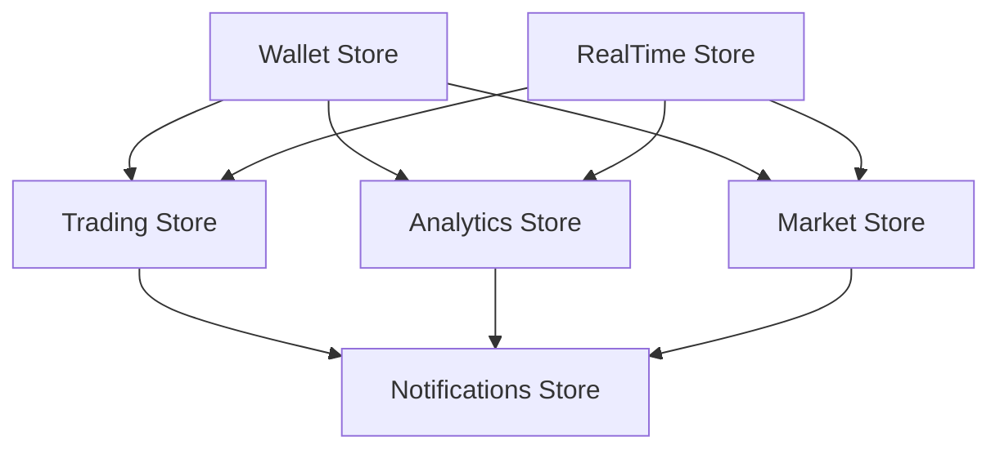
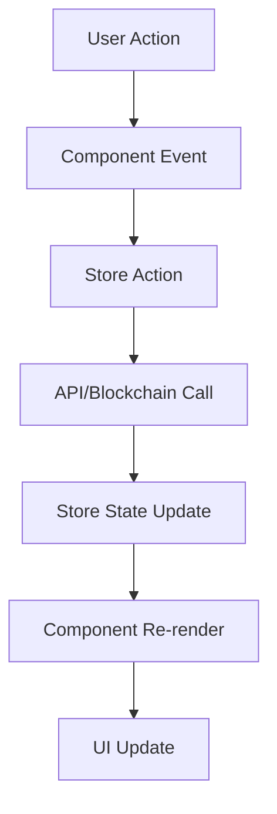
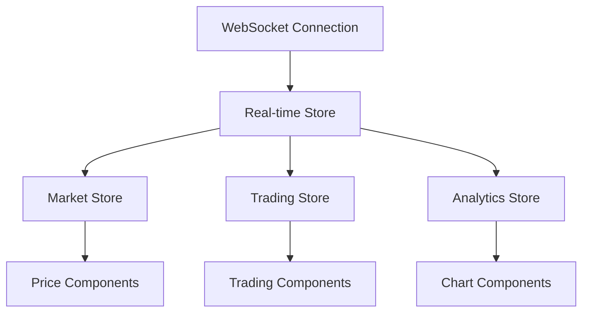

# 🏗️ Moby Market Frontend Architecture

## 📋 **Table of Contents**

- [Overview](#overview)
- [Technology Stack](#technology-stack)
- [Project Structure](#project-structure)
- [Component Architecture](#component-architecture)
- [State Management](#state-management)
- [Routing Strategy](#routing-strategy)
- [Data Flow](#data-flow)
- [Performance Optimization](#performance-optimization)
- [Security Architecture](#security-architecture)
- [Deployment Architecture](#deployment-architecture)

## 🎯 **Overview**

Moby Market frontend is built using a modern, scalable architecture that prioritizes performance, maintainability, and developer experience. The application follows a component-driven development approach with strict TypeScript integration and reactive state management.

### **Core Principles**

1. **Component Composition** - Reusable, composable components
2. **Type Safety** - Strict TypeScript throughout
3. **Reactive State** - Predictable state management with Pinia
4. **Performance First** - Optimized for speed and efficiency
5. **Mobile First** - Responsive design from the ground up
6. **Accessibility** - WCAG 2.1 AA compliance

## 🛠️ **Technology Stack**

### **Frontend Framework**

```typescript
Vue.js 3.4+                 // Progressive JavaScript framework
├── Composition API         // Modern Vue.js paradigm
├── <script setup>         // Simplified component syntax
├── TypeScript 5.0+        // Static type checking
└── Vite 5.0+             // Next-generation build tool
```

### **Styling & UI**

```css
TailwindCSS 3.4+           // Utility-first CSS framework
├── SkeletonUI             // Premium component library
├── HeadlessUI             // Unstyled, accessible UI components
├── Heroicons              // Beautiful hand-crafted SVG icons
└── Custom Design System   // Moby Market brand system
```

### **State Management**

```typescript
Pinia 2.1+                 // Vue's official state library
├── Composition API        // Composable stores
├── TypeScript Support     // Fully typed stores
├── DevTools Integration   // Vue DevTools support
└── SSR Ready             // Server-side rendering support
```

### **Web3 Integration**

```typescript
viem 2.0+                  // Type-safe Ethereum library
├── wagmi 2.0+            // React Hooks for Ethereum
├── @wagmi/core           // Framework-agnostic core
├── WalletConnect v2      // Multi-wallet protocol
└── Ethers.js v6          // Ethereum interactions
```

### **Development Tools**

```json
{
  "build": "Vite",
  "testing": "Vitest + @vue/test-utils + Playwright",
  "linting": "ESLint + Prettier",
  "bundling": "Rollup (via Vite)",
  "deployment": "Docker + Nginx",
  "monitoring": "Sentry + Plausible Analytics"
}
```

## 📁 **Project Structure**

```
frontend/
├── public/                     # Static assets
│   ├── tokens/                # Token icons and images
│   ├── favicon.ico           # Application favicon
│   └── manifest.json         # PWA manifest
├── src/
│   ├── components/           # Vue components
│   │   ├── ui/              # Base UI components
│   │   │   ├── Button.vue
│   │   │   ├── Card.vue
│   │   │   ├── Input.vue
│   │   │   ├── Modal.vue
│   │   │   └── ...
│   │   ├── trading/         # Trading interface
│   │   │   ├── SwapInterface.vue
│   │   │   ├── MobileSwapInterface.vue
│   │   │   ├── LivePriceTicker.vue
│   │   │   └── ...
│   │   ├── whale/           # Whale intelligence
│   │   │   ├── WhaleIntelligenceDashboard.vue
│   │   │   ├── LiveWhaleActivityFeed.vue
│   │   │   ├── WhaleActivityHeatmap.vue
│   │   │   └── ...
│   │   ├── analytics/       # Analytics dashboard
│   │   │   ├── AnalyticsDashboard.vue
│   │   │   ├── charts/      # Chart components
│   │   │   ├── cards/       # Card components
│   │   │   └── portfolio/   # Portfolio components
│   │   └── wallet/          # Wallet components
│   │       ├── WalletConnector.vue
│   │       ├── WalletModal.vue
│   │       └── ...
│   ├── stores/              # Pinia state stores
│   │   ├── wallet.ts        # Wallet state
│   │   ├── trading.ts       # Trading state
│   │   ├── analytics.ts     # Analytics state
│   │   ├── notifications.ts # Notifications
│   │   └── market.ts        # Market data
│   ├── composables/         # Vue composables
│   │   ├── useWallet.ts     # Wallet management
│   │   ├── useRealTimeData.ts # WebSocket data
│   │   ├── useBreakpoints.ts # Responsive design
│   │   └── ...
│   ├── services/            # External services
│   │   ├── api.ts           # REST API client
│   │   ├── websocket.ts     # WebSocket service
│   │   ├── blockchain.ts    # Blockchain interactions
│   │   └── ...
│   ├── types/               # TypeScript definitions
│   │   ├── index.ts         # Main type exports
│   │   ├── api.ts           # API types
│   │   ├── wallet.ts        # Wallet types
│   │   └── ...
│   ├── utils/               # Utility functions
│   │   ├── formatters.ts    # Data formatting
│   │   ├── validators.ts    # Input validation
│   │   ├── constants.ts     # App constants
│   │   └── ...
│   ├── assets/              # Static assets
│   │   ├── styles/          # Global styles
│   │   ├── images/          # Images and graphics
│   │   └── fonts/           # Custom fonts
│   ├── router/              # Vue Router
│   │   ├── index.ts         # Main router config
│   │   └── guards.ts        # Route guards
│   ├── App.vue              # Root component
│   └── main.ts              # Application entry point
├── tests/                   # Test files
│   ├── unit/                # Unit tests
│   ├── integration/         # Integration tests
│   ├── e2e/                 # End-to-end tests
│   └── fixtures/            # Test fixtures
├── docs/                    # Documentation
├── config/                  # Configuration files
├── package.json             # Dependencies and scripts
├── vite.config.ts          # Vite configuration
├── tailwind.config.js      # Tailwind configuration
├── tsconfig.json           # TypeScript configuration
└── README.md               # Project documentation
```

## 🧩 **Component Architecture**

### **Component Hierarchy**

```
App.vue
├── Layout Components
│   ├── Header.vue
│   ├── Sidebar.vue
│   ├── Footer.vue
│   └── Navigation.vue
├── Page Components
│   ├── Dashboard.vue
│   ├── Trading.vue
│   ├── Analytics.vue
│   └── Whales.vue
├── Feature Components
│   ├── TradingInterface/
│   ├── WhaleIntelligence/
│   ├── PortfolioAnalytics/
│   └── WalletManagement/
└── UI Components
    ├── Button.vue
    ├── Card.vue
    ├── Modal.vue
    └── Form/
```

### **Component Types**

#### **1. UI Components** (`components/ui/`)
Base building blocks with no business logic:

```typescript
// Button.vue
interface ButtonProps {
  variant: 'primary' | 'secondary' | 'outline' | 'ghost' | 'danger'
  size: 'xs' | 'sm' | 'md' | 'lg' | 'xl'
  loading?: boolean
  disabled?: boolean
  iconLeft?: string
  iconRight?: string
}
```

#### **2. Feature Components** (`components/[feature]/`)
Business logic and feature-specific functionality:

```typescript
// SwapInterface.vue
interface SwapInterfaceProps {
  initialTokenIn?: Token
  initialTokenOut?: Token
  onSwapComplete?: (result: SwapResult) => void
}
```

#### **3. Layout Components** (`components/layout/`)
Application structure and navigation:

```typescript
// Header.vue
interface HeaderProps {
  showWalletConnection: boolean
  showNavigation: boolean
  compact?: boolean
}
```

### **Component Composition Patterns**

#### **Slot-based Composition**

```vue
<!-- Card.vue -->
<template>
  <div :class="cardClasses">
    <header v-if="$slots.header" class="card-header">
      <slot name="header" />
    </header>

    <main class="card-content">
      <slot />
    </main>

    <footer v-if="$slots.footer" class="card-footer">
      <slot name="footer" />
    </footer>
  </div>
</template>
```

#### **Composable Integration**

```vue
<!-- TradingInterface.vue -->
<script setup lang="ts">
import { useWallet } from '@/composables/useWallet'
import { useTradingStore } from '@/stores/trading'

const { isConnected, address } = useWallet()
const trading = useTradingStore()

// Component logic here
</script>
```

## 🗄️ **State Management**

### **Pinia Store Architecture**

```typescript
// stores/trading.ts
export const useTradingStore = defineStore('trading', () => {
  // State
  const tokenIn = ref<Token | null>(null)
  const tokenOut = ref<Token | null>(null)
  const amount = ref<string>('')
  const quote = ref<Quote | null>(null)

  // Getters
  const isValidTrade = computed(() => {
    return tokenIn.value && tokenOut.value && Number(amount.value) > 0
  })

  // Actions
  async function executeSwap(params: SwapParams): Promise<SwapResult> {
    // Trading logic
  }

  async function fetchQuote(): Promise<Quote> {
    // Quote fetching logic
  }

  return {
    // State
    tokenIn,
    tokenOut,
    amount,
    quote,

    // Getters
    isValidTrade,

    // Actions
    executeSwap,
    fetchQuote
  }
})
```

### **Store Relationships**



### **Store Communication Patterns**

#### **Direct Store Access**

```typescript
// Component accessing multiple stores
const wallet = useWalletStore()
const trading = useTradingStore()
const notifications = useNotificationStore()

// Watch for wallet changes
watch(() => wallet.isConnected, (connected) => {
  if (!connected) {
    trading.clearState()
  }
})
```

#### **Store Composition**

```typescript
// composables/useTrading.ts
export function useTrading() {
  const wallet = useWalletStore()
  const trading = useTradingStore()
  const notifications = useNotificationStore()

  const executeSwap = async (params: SwapParams) => {
    if (!wallet.isConnected) {
      notifications.error('Please connect your wallet')
      return
    }

    try {
      const result = await trading.executeSwap(params)
      notifications.success('Swap executed successfully')
      return result
    } catch (error) {
      notifications.error('Swap failed')
      throw error
    }
  }

  return {
    executeSwap,
    // Other composed functionality
  }
}
```

## 🛣️ **Routing Strategy**

### **Route Structure**

```typescript
// router/index.ts
const routes = [
  {
    path: '/',
    name: 'Dashboard',
    component: () => import('@/views/Dashboard.vue'),
    meta: { requiresAuth: false }
  },
  {
    path: '/trading',
    name: 'Trading',
    component: () => import('@/views/Trading.vue'),
    meta: { requiresAuth: true }
  },
  {
    path: '/analytics',
    name: 'Analytics',
    component: () => import('@/views/Analytics.vue'),
    children: [
      {
        path: 'overview',
        name: 'AnalyticsOverview',
        component: () => import('@/views/analytics/Overview.vue')
      },
      {
        path: 'portfolio',
        name: 'AnalyticsPortfolio',
        component: () => import('@/views/analytics/Portfolio.vue')
      },
      {
        path: 'risk',
        name: 'AnalyticsRisk',
        component: () => import('@/views/analytics/Risk.vue')
      }
    ]
  },
  {
    path: '/whales',
    name: 'WhaleIntelligence',
    component: () => import('@/views/WhaleIntelligence.vue')
  }
]
```

### **Route Guards**

```typescript
// router/guards.ts
export const authGuard: NavigationGuard = (to, from, next) => {
  const wallet = useWalletStore()

  if (to.meta.requiresAuth && !wallet.isConnected) {
    next({
      name: 'Dashboard',
      query: { redirect: to.fullPath }
    })
  } else {
    next()
  }
}
```

### **Lazy Loading Strategy**

```typescript
// Route-based code splitting
const Trading = () => import('@/views/Trading.vue')
const Analytics = () => import('@/views/Analytics.vue')

// Component-level lazy loading
const HeavyChart = defineAsyncComponent({
  loader: () => import('@/components/charts/HeavyChart.vue'),
  loadingComponent: LoadingSpinner,
  errorComponent: ErrorComponent,
  delay: 200,
  timeout: 3000
})
```

## 🔄 **Data Flow**

### **Unidirectional Data Flow**



### **Real-time Data Flow**



### **Error Handling Flow**

```typescript
// Global error handling
app.config.errorHandler = (error, instance, info) => {
  console.error('Vue error:', error, info)

  // Send to error tracking service
  Sentry.captureException(error, {
    contexts: {
      vue: {
        componentName: instance?.$options.name || 'Unknown',
        propsData: instance?.$props,
        info
      }
    }
  })

  // Show user-friendly error
  const notifications = useNotificationStore()
  notifications.error('An unexpected error occurred')
}
```

## ⚡ **Performance Optimization**

### **Bundle Optimization**

```typescript
// vite.config.ts
export default defineConfig({
  build: {
    rollupOptions: {
      output: {
        manualChunks: {
          // Vendor chunks
          'vue-vendor': ['vue', 'pinia', 'vue-router'],
          'web3-vendor': ['viem', 'wagmi', '@wagmi/core'],
          'ui-vendor': ['@headlessui/vue', '@heroicons/vue'],

          // Feature chunks
          'trading': [
            './src/components/trading',
            './src/stores/trading.ts'
          ],
          'analytics': [
            './src/components/analytics',
            './src/stores/analytics.ts'
          ],
          'whale-intelligence': [
            './src/components/whale',
            './src/stores/whales.ts'
          ]
        }
      }
    }
  }
})
```

### **Lazy Loading Strategies**

```typescript
// Dynamic imports for heavy components
const TradingViewChart = defineAsyncComponent({
  loader: () => import('@/components/charts/TradingViewChart.vue'),
  loadingComponent: ChartSkeleton,
  delay: 200
})

// Route-based splitting
const routes = [
  {
    path: '/analytics',
    component: () => import('@/views/Analytics.vue')
  }
]
```

### **Virtual Scrolling**

```vue
<!-- Large lists optimization -->
<template>
  <VirtualList
    :items="whaleActivities"
    :item-height="80"
    :container-height="400"
    v-slot="{ item }"
  >
    <WhaleActivityItem :activity="item" />
  </VirtualList>
</template>
```

### **Memoization**

```typescript
// Expensive computations
const expensiveComputation = computed(() => {
  return heavyCalculation(props.data)
})

// Component memoization
const MemoizedChart = defineComponent({
  name: 'MemoizedChart',
  props: ['data'],
  setup(props) {
    const cachedResult = computed(() => {
      return processChartData(props.data)
    })

    return { cachedResult }
  }
})
```

## 🔒 **Security Architecture**

### **Content Security Policy**

```html
<!-- CSP Headers -->
<meta http-equiv="Content-Security-Policy"
      content="default-src 'self';
               script-src 'self' 'unsafe-inline' https://cdn.jsdelivr.net;
               style-src 'self' 'unsafe-inline' https://fonts.googleapis.com;
               img-src 'self' data: https:;
               connect-src 'self' wss: https:;
               font-src 'self' https://fonts.gstatic.com;">
```

### **Input Sanitization**

```typescript
// utils/sanitize.ts
export function sanitizeInput(input: string): string {
  return DOMPurify.sanitize(input, {
    ALLOWED_TAGS: [],
    ALLOWED_ATTR: []
  })
}

// Address validation
export function validateEthereumAddress(address: string): boolean {
  return isAddress(address)
}

// Amount validation
export function validateAmount(amount: string): boolean {
  const num = parseFloat(amount)
  return !isNaN(num) && num > 0 && num < Number.MAX_SAFE_INTEGER
}
```

### **Wallet Security**

```typescript
// Secure wallet interactions
export async function signTransaction(tx: TransactionRequest): Promise<string> {
  // Verify transaction parameters
  if (!validateTransaction(tx)) {
    throw new Error('Invalid transaction parameters')
  }

  // Simulate transaction first
  const simulation = await simulateTransaction(tx)
  if (!simulation.success) {
    throw new Error('Transaction simulation failed')
  }

  // Sign and send
  return await wallet.signTransaction(tx)
}
```

### **Environment Security**

```typescript
// Secure environment handling
const config = {
  API_BASE_URL: import.meta.env.VITE_API_BASE_URL,
  WS_URL: import.meta.env.VITE_WS_URL,
  NETWORK_ID: import.meta.env.VITE_NETWORK_ID,

  // Never expose private keys or sensitive data
  // Use secure key management services
}

// Runtime checks
if (!config.API_BASE_URL) {
  throw new Error('API_BASE_URL environment variable is required')
}
```

## 🚀 **Deployment Architecture**

### **Build Pipeline**

```yaml
# .github/workflows/deploy.yml
name: Deploy to Production

on:
  push:
    branches: [main]

jobs:
  build:
    runs-on: ubuntu-latest
    steps:
      - uses: actions/checkout@v4
      - uses: actions/setup-node@v4
        with:
          node-version: '18'
          cache: 'pnpm'

      - name: Install dependencies
        run: pnpm install --frozen-lockfile

      - name: Run tests
        run: pnpm test

      - name: Build application
        run: pnpm build
        env:
          VITE_API_BASE_URL: ${{ secrets.API_BASE_URL }}
          VITE_WS_URL: ${{ secrets.WS_URL }}

      - name: Deploy to CDN
        run: pnpm deploy
```

### **Container Configuration**

```dockerfile
# Dockerfile
FROM node:18-alpine AS builder

WORKDIR /app
COPY package*.json ./
RUN npm ci --only=production

COPY . .
RUN npm run build

FROM nginx:alpine
COPY --from=builder /app/dist /usr/share/nginx/html
COPY nginx.conf /etc/nginx/conf.d/default.conf

EXPOSE 80
CMD ["nginx", "-g", "daemon off;"]
```

### **CDN Integration**

```typescript
// Asset optimization for CDN
const assetConfig = {
  images: {
    formats: ['webp', 'avif', 'png'],
    sizes: [320, 640, 1024, 1920],
    quality: 80
  },
  fonts: {
    preload: ['Inter-400', 'Inter-600', 'Inter-700'],
    display: 'swap'
  },
  scripts: {
    compression: 'gzip',
    minification: true,
    sourceMaps: false
  }
}
```

### **Monitoring & Analytics**

```typescript
// Performance monitoring
import { onLCP, onFID, onCLS } from 'web-vitals'

// Core Web Vitals tracking
onLCP(sendToAnalytics)
onFID(sendToAnalytics)
onCLS(sendToAnalytics)

function sendToAnalytics(metric) {
  // Send to analytics service
  analytics.track('web-vital', {
    name: metric.name,
    value: metric.value,
    id: metric.id
  })
}
```

---

This architecture documentation provides a comprehensive overview of the Moby Market frontend structure, patterns, and best practices. For specific implementation details, refer to the individual component and service documentation.